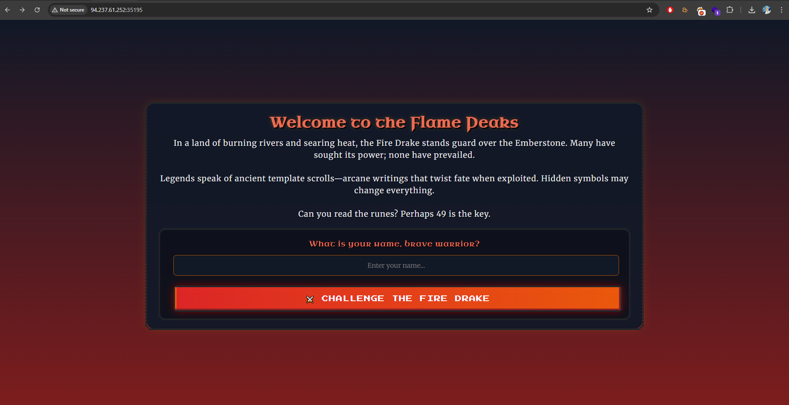
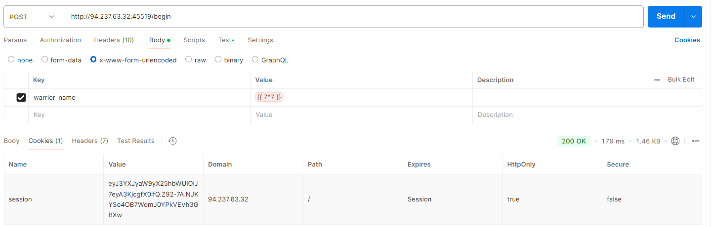
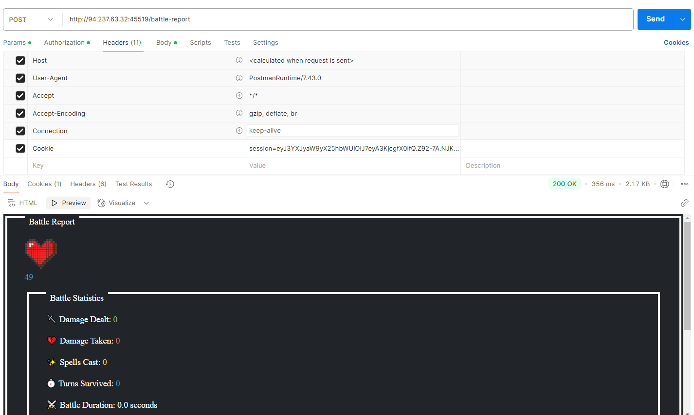
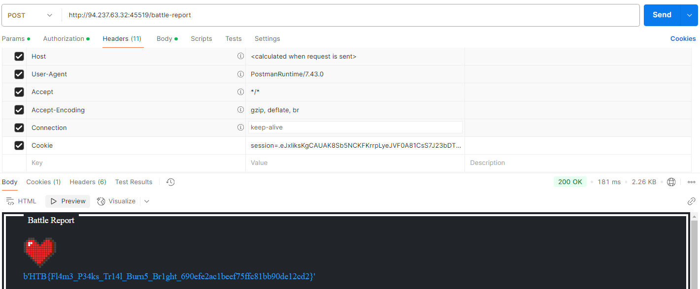

# Trial by Fire

As you ascend the treacherous slopes of the Flame Peaks, the scorching heat and shifting volcanic terrain test your endurance with every step. Rivers of molten lava carve fiery paths through the mountains, illuminating the night with an eerie crimson glow. The air is thick with ash, and the distant rumble of the earth warns of the danger that lies ahead. At the heart of this infernal landscape, a colossal Fire Drake awaits—a guardian of flame and fury, determined to judge those who dare trespass. With eyes like embers and scales hardened by centuries of heat, the Fire Drake does not attack blindly. Instead, it weaves illusions of fear, manifesting your deepest doubts and past failures. To reach the Emberstone, the legendary artifact hidden beyond its lair, you must prove your resilience, defying both the drake’s scorching onslaught and the mental trials it conjures. Stand firm, outwit its trickery, and strike with precision—only those with unyielding courage and strategic mastery will endure the Trial by Fire and claim their place among the legends of Eldoria.

# Flag
```
HTB{Fl4m3_P34ks_Tr14l_Burn5_Br1ght_03fc44c5a1eb1271a9ff5974a1eb37fb}
```

# Solution



The home page gives us a big hint to an SSTI vulnerability.
> Perhaps 49 is the key.

Examining [`routes.py`](src/challenge/application/blueprints/routes.py) shows where the SSTI may take place:

```py
@web.route('/battle-report', methods=['POST'])
def battle_report():
    warrior_name = session.get("warrior_name", "Unknown Warrior") #Payload injected here
    ...

    REPORT_TEMPLATE = f"""
            ...
                <p class="nes-text is-primary warrior-name">{warrior_name}</p>
            ...
    """

    return render_template_string(REPORT_TEMPLATE) #SSTI vuln here

```

Our payload can be injected into `warrior_name`, which will then be rendered after calling `/battle-report`. I used Postman to test this process by first calling `/begin`:



Using that session cookie to retrieve the battle report:



As you can see, the payload worked as `49` is displayed as our warrior's name.

A bit of snooping around led me to craft the following payload, which uses the class `<class '_frozen_importlib_external.FileLoader'>` to retrieve and read data from our desired file, in this case `/app/flag.txt`.

```
{{''.__class__.__mro__[1].__subclasses__()[134]("/app/flag.txt", "/app/flag.txt").get_data("/app/flag.txt")}}
```



# References

- Using FileLoader class: https://github.com/TheMaccabees/ctf-writeups/blob/master/HexionCTF2020/Notes/README.md