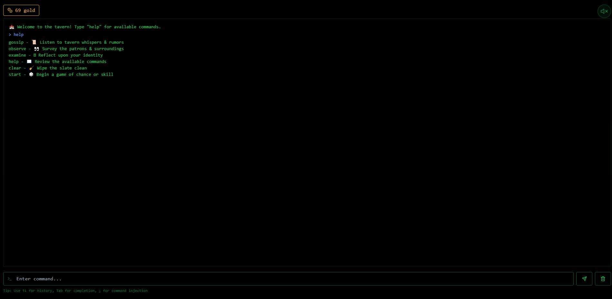
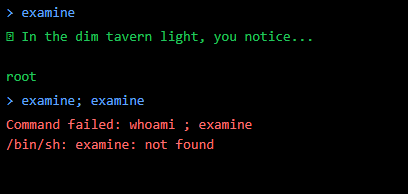
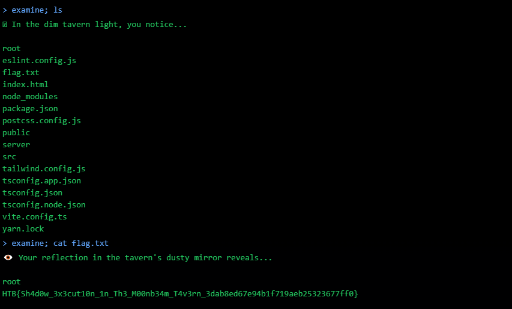

# Whispers of the Moonbeam

In the heart of Valeria's bustling capital, the Moonbeam Tavern stands as a lively hub of whispers, wagers, and illicit dealings. Beneath the laughter of drunken patrons and the clinking of tankards, it is said that the tavern harbors more than just ale and merriment—it is a covert meeting ground for spies, thieves, and those loyal to Malakar's cause. The Fellowship has learned that within the hidden backrooms of the Moonbeam Tavern, a crucial piece of information is being traded—the location of the Shadow Veil Cartographer, an informant who possesses a long-lost map detailing Malakar’s stronghold defenses. If the fellowship is to stand any chance of breaching the Obsidian Citadel, they must obtain this map before it falls into enemy hands.

# Flag
```
HTB{Sh4d0w_3x3cut10n_1n_Th3_M00nb34m_T4v3rn_77cd0fb0d126eea1f71b78b030126bc6}
```

# Solution

We are provided with a terminal interface, which also straight up tells us to use `;` for command injection at the bottom.



Trying out `examine` command, we learn that it is just an alias for `whoami`.

I tried to run `examine; examine`, giving this error:



Hence, we can just insert any standard Linux command after the `;`. 

