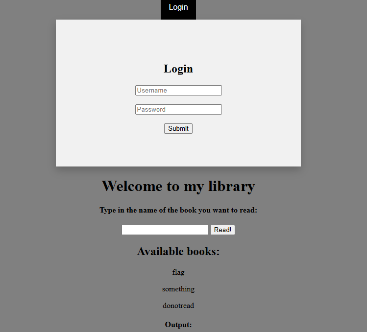

# Command library

Try out my library, and don't try to do anything funny with the input field!

# Flag
```
GCTF24{no7_50_s3cur3_C0mM4nD1nj3cTioN}
```

# Solution



There is an interesting login feature which we may need for later.

The nature of this challenge hints towards a RCE vulnerability. Trying `ls` as a payload:


Let's try to read `note.md` using `ls;cat note.md`:


We can easily bypass the client-side sanitisation by modifying a request through Burpsuite.


It seems the backend still does some sort of blacklisting. I fuzzed around with different inputs and found that these are disallowed: 
- Whitespaces ( )
- Forward slash (/)
- `cat` and `less` command

We can replace whitespaces with `${IFS}` and read the file using the `more` command. Hence, our payload:

```
more${IFS}note.md
```

Output:

```
::::::::::::::
note.md
::::::::::::::
## Note to self:
Credentials for test account is in the **/home** directory
Also, if you want to change directory and read the file inside, you will need to combine them in a single line
```

Explore the `/home` directory to find credentials.

```
::::::::::::::
/home/credentials.txt
::::::::::::::
username: givem
password: 3f149
```

Use these credentials to login into the website and get the flag.

