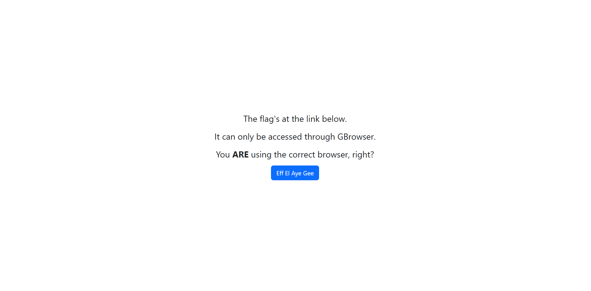
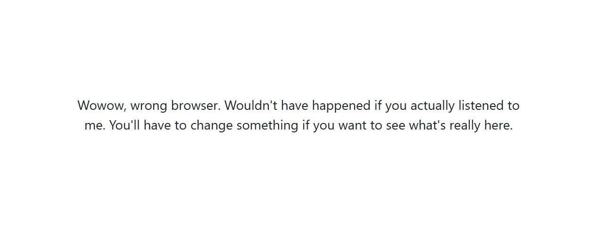

# GBrowser

The flag can only be accessed through GBrowser. What's that? How am I going to check if people are using GBrowser? Come on, surely it can't be that hard..

# Flag
```
GCTF24{W3lL_d0ne_AGENt47}
```

# Solution



The website prompts to access the flag's link through GBrowser. Opening the link (`http://chal1.gryphons.sg:8001/flag?`) using another browser like Google Chrome tells us we are using the wrong browser.



We just have to modify the "User-Agent" header to access the flag.

```bash
jerald@DESKTOP-HGSM9AM:~/ctf/gctf24/web$ curl http://chal1.gryphons.sg:8001/flag? -H "User-Agent:GBrowser"
<!DOCTYPE html>
<html lang="en">
<head>
    <meta charset="UTF-8">
    <meta http-equiv="X-UA-Compatible" content="IE=edge">
    <meta name="viewport" content="width=device-width, initial-scale=1.0">
    <link href="https://cdn.jsdelivr.net/npm/bootstrap@5.3.3/dist/css/bootstrap.min.css" rel="stylesheet" integrity="sha384-QWTKZyjpPEjISv5WaRU9OFeRpok6YctnYmDr5pNlyT2bRjXh0JMhjY6hW+ALEwIH" crossorigin="anonymous">
</head>
<body class="d-flex justify-content-center align-items-center vh-100">
    <p class="fs-3 w-50" style="text-align: center">GCTF24{W3lL_d0ne_AGENt47}</p>
</body>
</html>
```