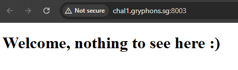
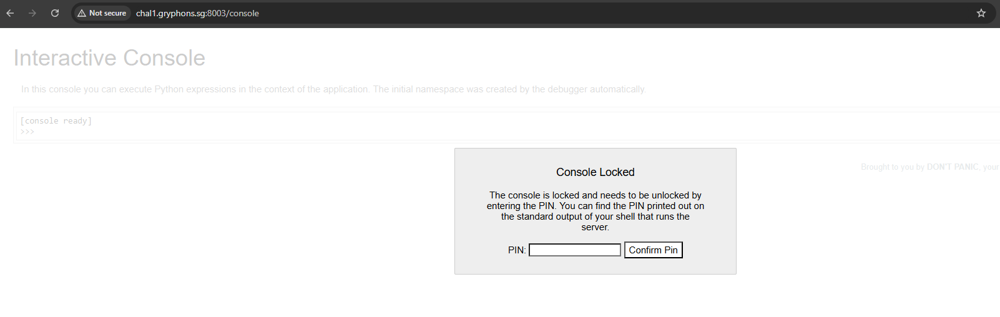
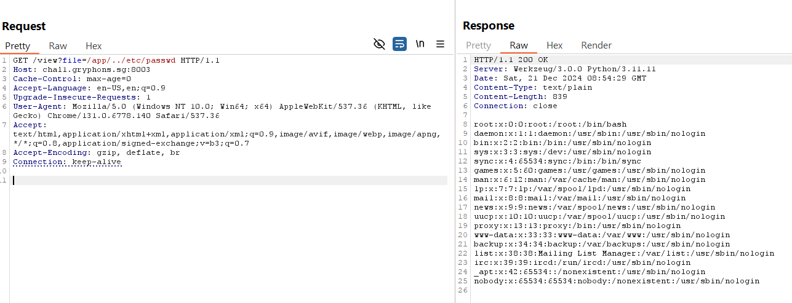
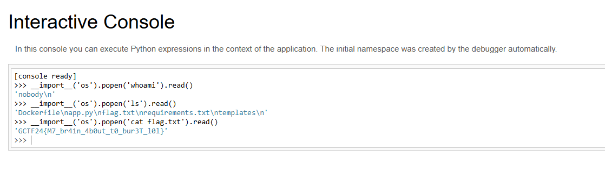

# PIN Synthesizer

Just a normal website, nothing to see here. :)

# Flag
```
GCTF24{M7_br41n_4b0ut_t0_bur3T_l0l}
```

# Solution



Nothing interesting on the surface. Viewing the source code gives us information on an endpoint:

```html

<!DOCTYPE html>
<html>

<head>
  <title>PIN Synthesizer</title>
</head>

<body>
  <h1>Welcome, nothing to see here :)</h1>
  <div style="height: 100vh;"></div>
  <a href="/view?file=app%2Fapp.py">View Source Code</a>
</body>

</html>
```

Browsing to `/view?file=app%2Fapp.py` gives us the server's source code in plaintext:

```py
import os

from flask import Flask, render_template, request

app = Flask(__name__)


@app.route("/")
def index():
    return render_template("index.html")


@app.route("/view")
def view():
    filename = request.args.get("file")
    if filename:
        path = os.path.join("/", filename)

        if not path.startswith("/app/"):
            return "Invalid path", 400

        if not os.path.exists(path):
            return "File not found", 404

        if path.endswith((".txt", ".log", ".html")):
            return "Invalid file type.", 400

        try:
            with open(path, "r") as f:
                content = f.read()
            return content, 200, {"Content-Type": "text/plain"}
        except Exception:
            return "An error occurred while reading the file.", 500

    return "Specify a file to view with ?file="


if __name__ == "__main__":
    app.run(debug=True, host="0.0.0.0", port=1337)  #debug enabled
```

From this, we learn a few things:
- Use `/view?file=` to read files
- Filepath must start with `/app/`
- Filepath must exist
- File extension cannot be `.txt`, `.log`, `.html`
- App is running in debug mode

As debug mode is enabled, we can browse to `/console` to get access to a shell:



We can derive the PIN if we can read specific files on the system. Using Path Traversal techniques, we are able to read files even outside of `/app` by using `../`:



In this scenario, the information needed are:

- `nobody`: User running the app
- `/usr/local/lib/python3.11/site-packages/flask/app.py`: Obtained through fuzzing and testing presence of file
- `2485378220034`: Read `/proc/net/arp` to get network interface, then read `/sys/class/net/<interface>/address`. 
Convert the hexadecimal MAC address to decimal.
- `c8f9da87-a91a-4c4a-8471-84de92bce74c5ac4821f05be3bf6fc15be650f87babc56363b1c9a70e7b8f781b37f6ea2a0fa`: Read `/proc/sys/kernel/random/boot_id` value, concatenated with the first line of `/proc/self/cgroup` after the last slash (/). 


Refer to the [exploit script](exploit.py) (Reference from [HackTricks Flask Debug](https://book.hacktricks.xyz/network-services-pentesting/pentesting-web/werkzeug)). After running the exploit script, we can obtain the PIN to unlock the interactive shell and run commands to read the flag.

In this case, the PIN is 393-611-768.

