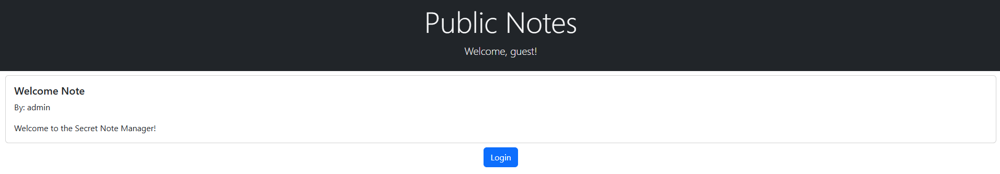
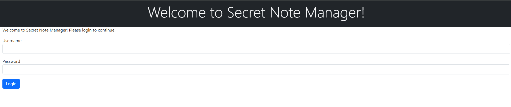
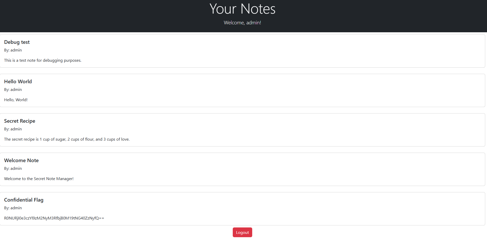

# Secret Note Manager

Welcome to the Secret Note Manager! The premier note-taking service for all your secret notes.

# Flag
```
GCTF24{w3b_s3cr3t_n0t3_m4n4g3r}
```

# Solution



The home page tells us that an `admin` account exists, which we may be required to login into.



I tried a simple SQLi payload (Username:`admin' or 1=1-- -`) to start off and it worked. 



Decode the contents of the "Confidential Flag" note.

```bash
echo R0NURjI0e3czYl9zM2NyM3RfbjB0M19tNG40ZzNyfQ== | base64 -d
```