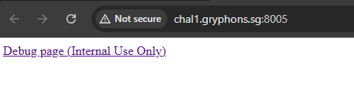

# The Reflector

This website features a "debug" page intended for internal use only. It reflects back any GET parameters you send. However, access is strictly restricted. Can you bypass the restrictions?

# Flag
```
GCTF24{S$T1_Th3_M0s1_r3Str1cT1i0n}
```

# Solution



Clicking the link leads us to `/debug` , with access being denied.


According to [`app.py`](src/app.py), the `X-Forwarded-For` header in the request must be localhost to be granted access to the debug page. Use Burpsuite to add the header.

```py
@app.route("/debug")
def debug():
    if request.headers.get("X-Forwarded-For") != "127.0.0.1":
        return "Access Denied", 403

    params = request.args.to_dict()
    if not params:
        return render_template("debug.html")

    ...
    ...
```


The purpose of the debug page is that all URL parameters in the request will be reflected onto the page using `render_template_string()` function. There is also a blacklist to filter some dangerous characters.

```py
@app.route("/debug")
def debug():
    ...
    ...

    forbidden_chars = ["<", ">", '"', "'", "[", "]"]

    for key, value in params.items():
        for char in forbidden_chars:
            if char in value:
                return "Forbidden character used!", 400

    reflected_output = ""
    for key, value in params.items():
        reflected_output += f"{key} = {value}<br>"

    try:
        rendered_output = render_template_string(reflected_output)
        return rendered_output
    except Exception:
        return "Template Error", 500
```

As curly brackets (`{}`) are not blacklisted, we can perform an SSTI attack to read files. From the Dockerfile, we know the flag resides in `/app/flag.txt`. Using the following payload:


The issue is that we cannot include quote characters as they are blacklisted. Hence, we can assign a HTTP header to hold the flag path and refer to its value from the parameters as such to get the flag:

