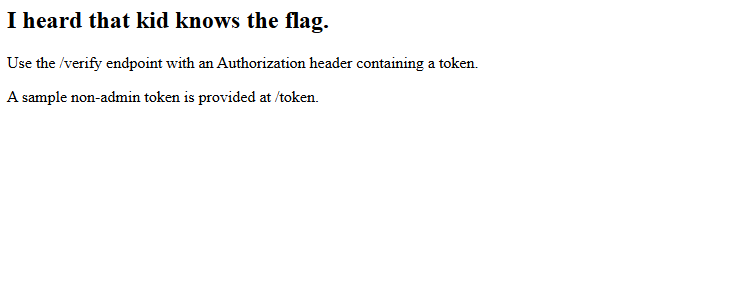
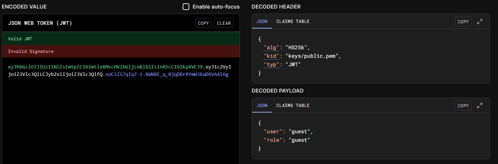
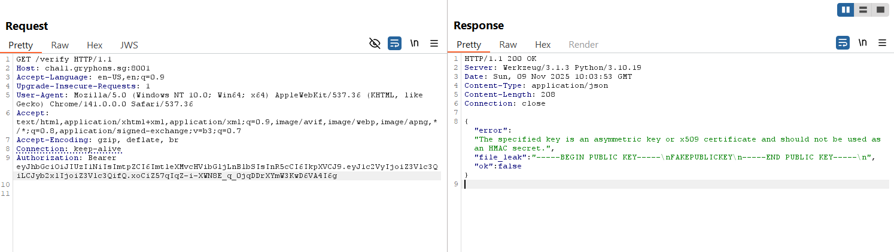

# Kid Named Jason

That kid probably has the flag...

# Flag
```
GCTF25{t0ken_of_4ppreciation}
```

# Solution



Visiting `/token` shows us a sample token with these headers and payload:



The `kid` claim in the header denotes which key to use to sign the token. In this case, it is using the key in `keys/public.pem`.

Visiting `/verify` with this token:



Seems to be a file leak of whatever file we specify in `kid`. Maybe we can try to leak the flag file using this method (See [exploit script](hack.py)). We specify `kid` to be `/flag`, and the flag is leaked.


