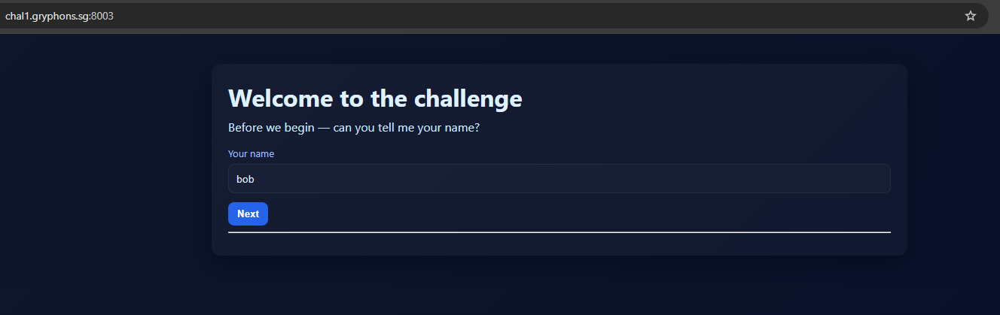
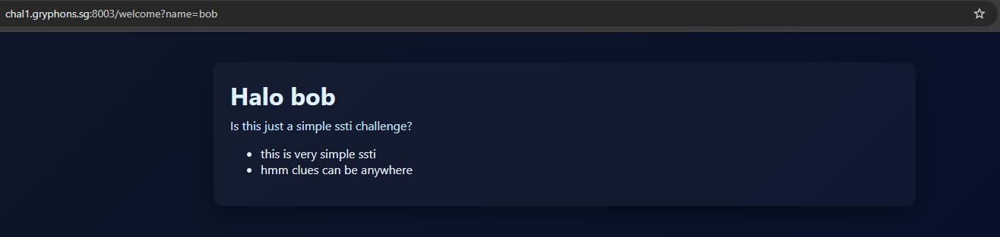
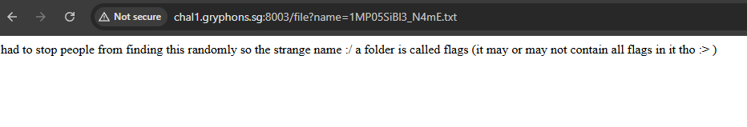
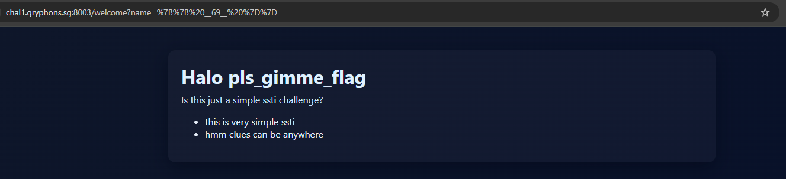
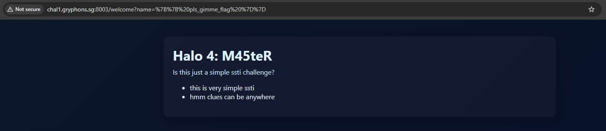

# Treasure Hunt

Go hunting for a flag in this puzzly website! Hopefully you dont get bambozzled or lost in the sea of clues...

# Flag
```
GCTF25{5STI_p47H_7Rav3R5A1_M45teR}
```

# Solution



Let's explore the website. Keying in `bob` as the name:



There are hints that SSTI may be involved. However, we uncover more clues in the comments by inspecting every file in this web server (even CSS files). The following are all the collated comments from the various files:

Comments in `/`:
```html
<!-- This is actually a path traversal challenge :D -->
<!-- hopefully no one finds this especially since there was another hint nested right before this -->
<!-- a magic word is: __69__ -->
<!-- Wow really digging deep into the html huh -->
<!-- 1MP05SiBl3_N4mE.txt should be the easiest traversal -->
```

Comments in `/welcome?name=bob`:
```html
<!-- only one useful information can be found without going backwards -->
<!-- Wow you bothered checking here -->
<!-- .../file?name=... -->
```

Comments in `/public/style.css`:
```css
/* wow you thought about looking at css :D */
/* try flag0 and flag5 cuz they are really helpful :D */
/* A secret windows batch file was seen near part1.txt */
```

The first comment tells us this is actually a path traversal challenge, and we should try viewing `1MP05SiBl3_N4mE.txt`. By using the `/file?name=` endpoint hinted to us:



Now we know there is a folder called `/flags` somewhere in the webserver.
We also know that `part1.txt` and `part2.txt` exists, with a secret batch file seen near `part1.txt`. After some manual fuzzing for these files, I managed to view them:

```
/file?name=../flags/part1.txt           part 1: 5STI_
/file?name=../part2.txt                 part 2: p47H_
/file?name=../flags/secret.bat          part 3: 7Rav3R5A1_
```

What's left is the last part of the flag. Recall that this is could also be a SSTI challenge, and by inputing the magic word given to us as a payload `{{ __69__ }}` into the name field:



Keying this value as another payload `{{ pls_gimme_flag }}`gives us the final part: `4: M45teR`

