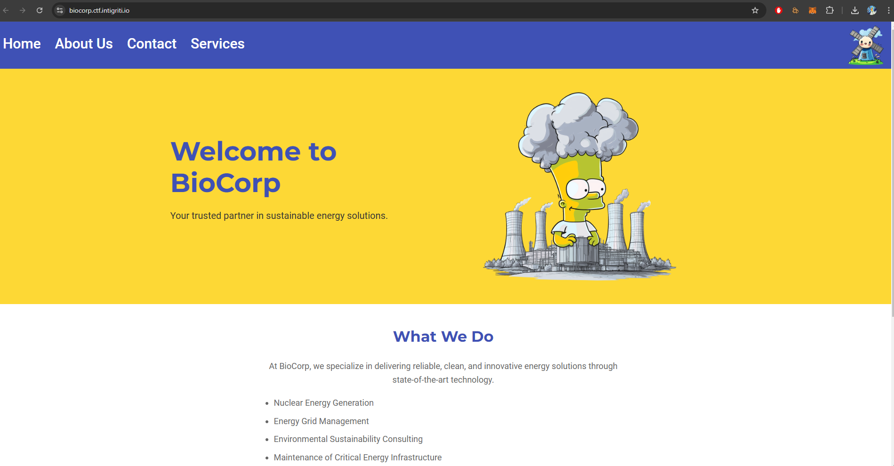

# BioCorp

BioCorp contacted us with some concerns about the security of their network. Specifically, they want to make sure they've decoupled any dangerous functionality from the public facing website. Could you give it a quick review?

# Flag
```
INTIGRITI{c4r3ful_w17h_7h053_c0n7r0l5_0r_7h3r3_w1ll_b3_4_m3l7d0wn}
```

# Solution



Trying to browse directly to `panel.php` gives us an unauthorised error.
The source code of [`panel.php`](src/web/app/panel.php) reveals some important information.

```php
$ip_address = $_SERVER['HTTP_X_BIOCORP_VPN'] ?? $_SERVER['REMOTE_ADDR'];

if ($ip_address !== '80.187.61.102') {
    echo "<h1>Access Denied</h1>";
    echo "<p>You do not have permission to access this page.</p>";
    exit;
}
```

We can add a `X-BIOCORP-VPN: 80.187.61.102` HTTP header to access the panel.


```php
if ($_SERVER['REQUEST_METHOD'] === 'POST' && strpos($_SERVER['CONTENT_TYPE'], 'application/xml') !== false) {
    $xml_data = file_get_contents('php://input');
    $doc = new DOMDocument();
    if (!$doc->loadXML($xml_data, LIBXML_NOENT)) {
        echo "<h1>Invalid XML</h1>";
        exit;
    }
} else {
    $xml_data = file_get_contents('data/reactor_data.xml');
    $doc = new DOMDocument();
    $doc->loadXML($xml_data, LIBXML_NOENT); // VULNERABLE TO XXE ATTACK
}

$temperature = $doc->getElementsByTagName('temperature')->item(0)->nodeValue ?? 'Unknown';
$pressure = $doc->getElementsByTagName('pressure')->item(0)->nodeValue ?? 'Unknown';
$control_rods = $doc->getElementsByTagName('control_rods')->item(0)->nodeValue ?? 'Unknown';
```

If the request method is POST, the server reads user-input XML from the request body and parses it into a DOMDocument object. 

We can perform an XXE attack and read the `flag.txt` file.

