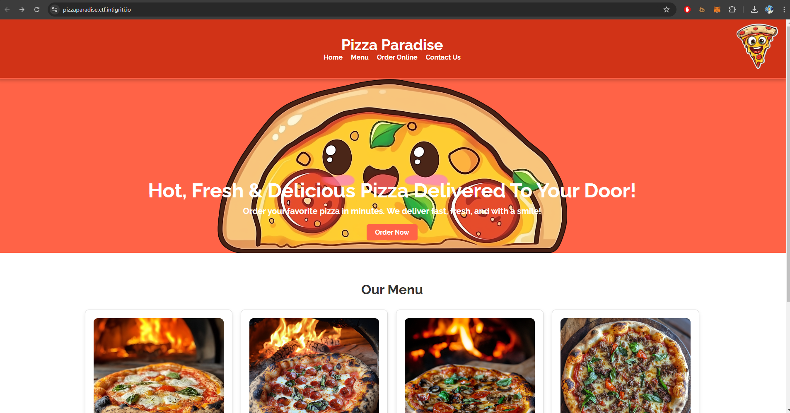
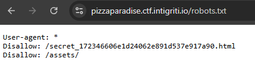
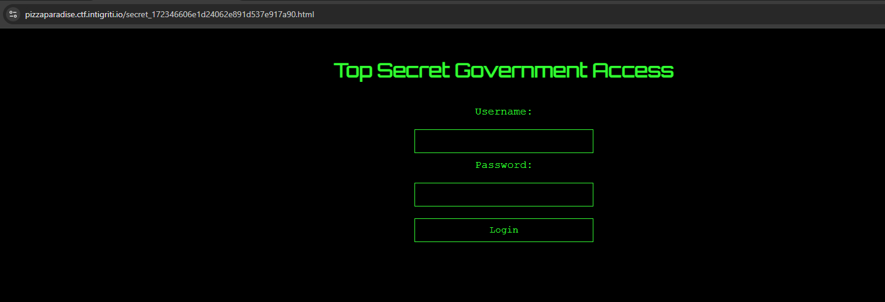

# Pizza Paradise

Something weird going on at this pizza store!!

# Flag
```
INTIGRITI{70p_53cr37_m15510n_c0mpl373}
```

# Solution
The website seems like a static page which doesn't accept any user input for us to leverage.



Checking for `robots.txt`, there are some entries.



Browse to the secret page.



The source code hints that client-side authentication is being used.

```html
        <script src="/assets/js/auth.js"></script>
        <script src="https://cdnjs.cloudflare.com/ajax/libs/crypto-js/4.1.1/crypto-js.min.js"></script>
        <script>
            function hashPassword(password) {
                return CryptoJS.SHA256(password).toString();
            }

            function validate() {
                const username = document.getElementById("username").value;
                const password = document.getElementById("password").value;

                const credentials = getCredentials();
                const passwordHash = hashPassword(password);

                if (
                    username === credentials.username &&
                    passwordHash === credentials.passwordHash
                ) {
                    return true;
                } else {
                    alert("Invalid credentials!");
                    return false;
                }
            }
        </script>
```

Contents of `/assets/js/auth.js`:

```js
const validUsername = "agent_1337";
const validPasswordHash = "91a915b6bdcfb47045859288a9e2bd651af246f07a083f11958550056bed8eac";

function getCredentials() {
    return {
        username: validUsername,
        passwordHash: validPasswordHash,
    };
}
```

Enter the hash into any password cracker.

