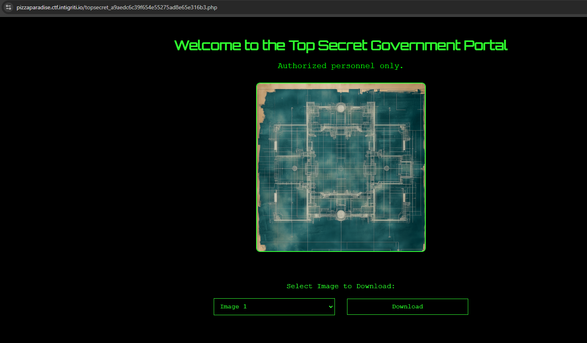
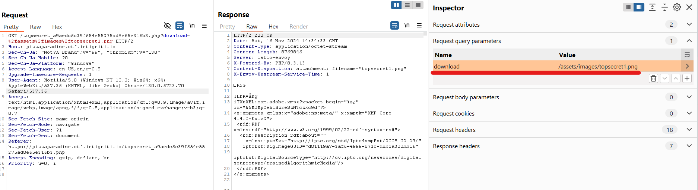

# Pizza Paradise

Something weird going on at this pizza store!!

# Flag
```
INTIGRITI{70p_53cr37_m15510n_c0mpl373}
```

# Solution
The website seems like a static page which doesn't accept any user input for us to leverage.


Checking for `robots.txt`, there are some entries.


Browse to the secret page.


The source code hints that client-side authentication is being used.

```html
        <script src="/assets/js/auth.js"></script>
        <script src="https://cdnjs.cloudflare.com/ajax/libs/crypto-js/4.1.1/crypto-js.min.js"></script>
        <script>
            function hashPassword(password) {
                return CryptoJS.SHA256(password).toString();
            }

            function validate() {
                const username = document.getElementById("username").value;
                const password = document.getElementById("password").value;

                const credentials = getCredentials();
                const passwordHash = hashPassword(password);

                if (
                    username === credentials.username &&
                    passwordHash === credentials.passwordHash
                ) {
                    return true;
                } else {
                    alert("Invalid credentials!");
                    return false;
                }
            }
        </script>
```

Contents of `/assets/js/auth.js`:

```js
const validUsername = "agent_1337";
const validPasswordHash = "91a915b6bdcfb47045859288a9e2bd651af246f07a083f11958550056bed8eac";

function getCredentials() {
    return {
        username: validUsername,
        passwordHash: validPasswordHash,
    };
}
```

Enter the hash into any password cracker to get the password. You can use the credentials (`agent_1337:intel420`) to login.

We are redirected to a secret page to download images.



Using burpsuite to intercept the request to download the images, we can see the request query parameters:



By changing the `download` value to `/assets/images/../../topsecret_a9aedc6c39f654e55275ad8e65e316b3.php`, we can download the source code of the php file itself where the flag is.

```php
<?php

$flag = 'INTIGRITI{70p_53cr37_m15510n_c0mpl373}';

if (isset($_GET['download'])) {
    $file = $_GET['download'];
    if (strpos($file, '/assets/images/') === 0) {
        $filePath = __DIR__ . '/' . $file;
        if (file_exists($filePath)) {
            header('Content-Type: application/octet-stream');
            header('Content-Disposition: attachment; filename="' . basename($filePath) . '"');
            header('Content-Length: ' . filesize($filePath));
            readfile($filePath);
            exit();
        } else {
            die('File not found!');
        }
    } else {
        die('File path not allowed!');
    }
}
?>

<!DOCTYPE html>
<html lang="en">
<head>
    <meta charset="UTF-8">
    <title>Top Secret Portal</title>
    <link href="https://fonts.googleapis.com/css2?family=Orbitron&display=swap" rel="stylesheet">
    <link rel="stylesheet" href="/assets/css/secret-theme.css">
    <script src="/assets/js/displayImage.js"></script>
</head>
<body>
    <div class="container">
        <h1>Welcome to the Top Secret Government Portal</h1>
        <p>Authorized personnel only.</p>

        

        <form method="GET" action="">
            <label for="image">Select Image to Download:</label>
            <select name="download" id="image" onchange="updateImage()">
                <option value="/assets/images/topsecret1.png">Image 1</option>
                <option value="/assets/images/topsecret2.png">Image 2</option>
                <option value="/assets/images/topsecret3.png">Image 3</option>
                <option value="/assets/images/topsecret4.png">Image 4</option>
            </select>
            <button type="submit">Download</button>
        </form>
    </div>
</body>
</html>
```