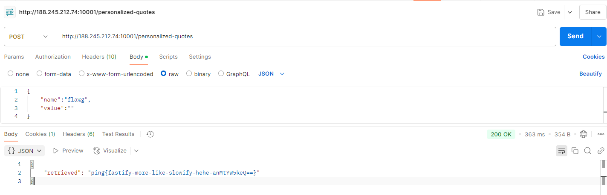

# slow-down

> We have a quotes app for you! If you want some inspiration first, make sure to checkout the default quotes we provided. Please don't read our flag tho, that's some private stuff.

# Flag
```
ping{fastify-more-like-slowify-hehe-anMtYW5keQ==}
```

# Solution

In the server code, the flag is stored as a value in the `defaultQuotes` dictionary. If we try obtain the flag by calling the `/default-quotes/:quoteName` API, it tells us we are not allowed, due to the following check:

```js
fastify.get("/default-quotes/:quoteName", async (req, reply) => {
	const param = req.params["quoteName"];
	if (param === "flag") {
		return reply.status(403).send("not allowed");
	}
	return reply.send(getAll(defaultQuotes)[param] ?? "not found");
});
```


However, we can leverage on the POST `/personalized-quotes` API.

```js
// Update your own quotes or retrieve
fastify.post("/personalized-quotes", async (req, reply) => {
	const { name, value } = req.body;
	...
	if (defaultQuotes[name]) {
		return reply.status(400).send({ error: "Already exists in default" });
	}

	const sanitizedName = name.replace(/[^a-zA-Z0-9 ]/g, "");
	if (value) {
		req.session.quotes[sanitizedName] = value;
		return reply.send({ updated: req.session.quotes[sanitizedName] });
	}
	return reply.send({
		retrieved:
			req.session.quotes[sanitizedName] ?? defaultQuotes[sanitizedName],
	});
});
```

If we try sending `name` set to `flag`, it tells us that the quote already exists by default. Using the sanitization function to our advantage, we can set it as something like `fla%g`, whereby non-alphanumeric characters are replaced with an empty string. And by sending in an empty `value`, the server retrieves the `flag` from the dictionary.

